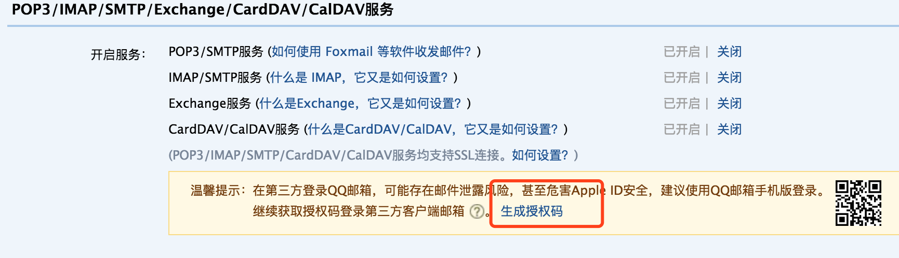

# Android Mail 
[](https://jitpack.io/#zongxiaomi/AndroidMail)
### 前言
Android前端一般都使用埋点或者听云第其他的云平台作为分析日志的工具，但是一些小量的日志或者数据可以用邮件去分析，因为Python、JAVA、PHP都有封装的类库去发送邮件，所以一般做法是调用网络接口让后台去发送邮件，其实Android中也可以发送邮件，其实整合的JAVA的类库。
## 使用方法

```groovy
在项目build.gradle 中添加
allprojects {
    repositories {
        maven { url 'https://jitpack.io' }
    }
}

在App 或者要依赖的Library中添加 

compile 'com.github.zongxiaomi:AndroidMail:1.05'
```
如果想知道怎么把自己的library发布到github 并且依赖它，以及里面的坑，请看简书[把自己的library发布到github 并且依赖它，这篇就够了](http://www.jianshu.com/p/d4fc146fc76b)

## 注意事项
- QQ
 1. host : smtp.qq.com VIP 邮箱另试
 2. port : 25 
 3. 一定要去网页版邮箱--设置--账户 打开POP3/SMTP服务 、IMAP/SMTP服务，然后用下边的生成授权码作为密码
 4. 请手动设置 mail.setMailType(MailType.QQ) 否则会认证失败，
 


- 163 
1. host : smtp.163.com
2. port : 25 有很多说是其他端口的，但是我试了都不对

- 公司邮箱
1. 还是仔细问下公司的It同事，一定确定好Host 和端口号，区分是否有VIP 邮箱


## 出现的问题
> 如果是认证失败，首先检查一下` Mail.setUserName() 是否用邮箱地址，一般不要用邮箱地址，用@ 前面的用户名 `

如果打开调试模式，请设置 `Mail.setDebug(true)`,如果要添加Properties ，value 的值一定要是 字符串的"true" 或"false"


## 代码展示

- 发送文本

```
        Mail mail = new Mail();
        mail.setMailServerHost(HOST);
        mail.setMailServerPort(PORT);
        mail.setValidate(true);
        String[] split = FROM_ADD.split("@");

        mail.setUserName(split[0]); // 你的邮箱地址前一半
        mail.setPassword(FROM_PSW);// 您的邮箱密码
        mail.setFromAddress(FROM_ADD); // 发送的邮箱
        mail.setToAddress(toAdds); // 发到哪个邮件去
        mail.setCcAddress(ccAdds);// 抄送邮件
        mail.setBccAddress(bccAdds);// 秘密抄送邮件
        mail.setSubject("测试结果"); // 邮件主题
        mail.setContent("嗨 all,"); // 邮件文本
        MailSender mailSender=new MailSender();
        mailSender.sendTextMail(mail);// 记得放子线程
```
- 发送附件

```java
        Mail mail = new Mail();
        mail.setMailServerHost(HOST);
        mail.setMailServerPort(PORT);
        mail.setValidate(true);
        String[] split = FROM_ADD.split("@");

        mail.setUserName(split[0]); // 你的邮箱地址前一半
        mail.setPassword(FROM_PSW);// 您的邮箱密码
        mail.setFromAddress(FROM_ADD); // 发送的邮箱
        mail.setToAddress(toAdds); // 发到哪个邮件去
        mail.setCcAddress(ccAdds);// 抄送邮件
        mail.setBccAddress(bccAdds);// 秘密抄送邮件
        mail.setSubject("测试结果"); // 邮件主题
        mail.setContent("嗨 all 附件内容为--,"); // 邮件文本
        MailSender mailSender=new MailSender();
        mailSender.sendMailWithFile(new File(paht),mail);// 记得放子线程
```
- 发送Html邮件

```java
        Mail mail = new Mail();
        mail.setMailServerHost(HOST);
        mail.setMailServerPort(PORT);
        mail.setValidate(true);
        String[] split = FROM_ADD.split("@");

        mail.setUserName(split[0]); // 你的邮箱地址前一半
        mail.setPassword(FROM_PSW);// 您的邮箱密码
        mail.setFromAddress(FROM_ADD); // 发送的邮箱
        mail.setToAddress(toAdds); // 发到哪个邮件去
        mail.setCcAddress(ccAdds);// 抄送邮件
        mail.setBccAddress(bccAdds);// 秘密抄送邮件
        mail.setSubject("Html测试"); // 邮件主题
        mail.setContent("<h1>嗨 这是网页内容</h1>"); // 邮件文本
        MailSender mailSender=new MailSender();
        mailSender.sendHtmlMail(mail);// 记得放子线程
```